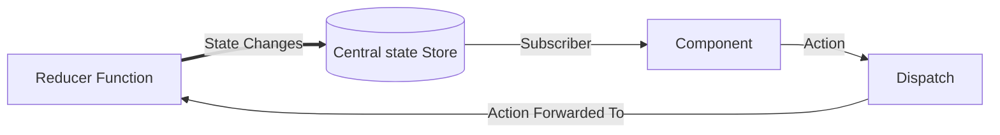

# Redux

So, first we will explore a little about redux itself and then it's binding will be discussed next.

First install `redux` with npm or yarn.

```
$ npm install redux
```

## Redux Data Flow

So, the flow Chart shown below



**Note** Action is simply a JavaScript Object, according to it's default specification it should have a `type` and `payload`

It has 3 Parts

- The Central State Store, this is Managed by `Redux`
- Reducer Function, this has to supplied by the Developer
- Dispatch Function, this supplied by `Redux`, where we have to input the `Action`.

### Creating a Store

Once `redux` package is installed, we extract the `redux` object from the library which has the required functions.

```js
const redux = require("redux");
```

It has a function called `createStore`, which is used to make the store, it take one argument the `Reducer` function,
which is discussed next.

```js
const store = redux.createStore(reducer);
```

This will create the store, as shown in the flow diagram, this like the database where the states are stored.

## Reducer Function

First thing to note is that, `Redux` expects `Reducers` to be a pure function.

Pure Function are the function, which expects same output for the same input. So, any kind of side-effects are not handled here.
This make state management predicatable.

This gets two argument `Previous State` and `Action`, Action is supplied by Dispatch.

**Important** By default states are immutable objects. So, changing the previous state is not recoomanded, always make a new object only.

```js
function reducer(state, action) {
  switch (
    action.type
    // Mange each case
  ) {
  }

  /*Dont Mutate the state, always create a new object*/

  return newState;
}
```

## Dispatch and Action

Action is a `plain JS object` and this must contain the key `type` and can attach any data which is stored in `payload`.

The dispatch function is attach to the store object

```js
store.dispatch({
  type: "SOME_UNIQUE_IDENTIFIER",
  payload: {
    ...your_data,
  },
});
```

## Using the Store State an Subscriber

To use the Stored State, we get it by using `getState` method in `store`. But this is not enough as we have to call it again once the state changes.

To know which function use the stroe state, we have to subscribe to the store, this can be done by `subscribe` method in store.

```js
function foo() {
  const state = store.getState();

  // Use the Sate here
}

store.subscribe(foo); // foo will be called each time the state changes
```
